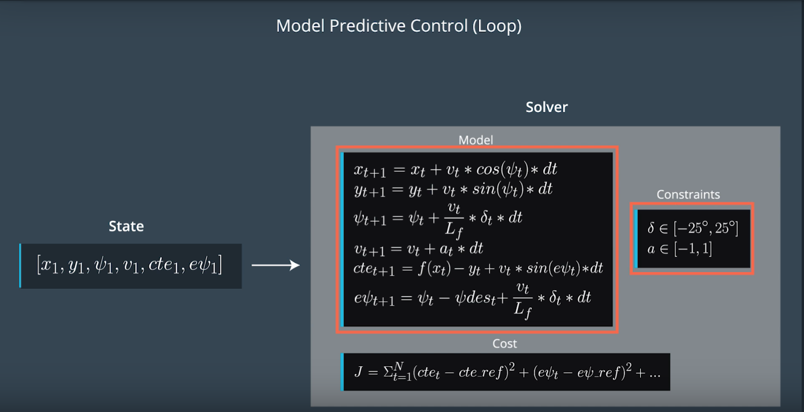

## Overview

In this project, Model Predictive Control to drive the car around the track will be implemented. 

The controller will optimize the actuator inputs to follow the reference trajectory and to minimize the cost of the predicted trjactory.

## Prepare

Ipopt is used in this project to optimize the control input and CapAD is used for automation differentiation.

When installing Ipopt, I followed 'install\_Ipopt_CppAD.md' description to install them on Mac, but encounters a problem.

Fortunately, I found this issue,
https://github.com/udacity/CarND-MPC-Project/issues/34
Here is for a record about this issue.

## MPC

As the lecture presented, MPC mainly contains the following steps:

1. Set N and dt.
2. Fit the polynomial to the waypoints.
3. Calculate initial cross trach error and orientation error values.
4. Define the components of the cost function (state, actuators, etc).
5. Define the model constraints. These are the state update equations defined in the Vehicle Models module.

There is one image from lecture is the main part of MPC.
.

#### state, actuators
In order to keep track of the state of the car, the state shall be obtained and also the control input which will impact the next state.

The state mainly contains position x, position y, the orientation psi, the velocity v of the car. The cte and epsi are also contained in the state.

The control inputs are mainly from the steering wheel, throttle and break pedals. These actuators will impact the orientation and the velocity which are refered as delta and a.

#### constraints

The actuators of the cars has some constraints. So the lower and upper bounds shall be set.

#### cost function

As the previous state and control inputs can be obtained, the next state can also be predicted based on the model which is presented as model equations.

Via adjusting the control inputs, the difference between the prediction and the reference trajectory can be minimized. The cost function is defined to evaluate it.

Except the state cte, psi, velocity, the control inputs delta and a, the difference between next control input state and current one are also added into the cost function, which will make a smoother rate change. In order to make a smoother steering transitions, and also the smoother acceleration, these part cost will be multiply a value which is >1.  

#### parameters 

There are some parameters that shall be set. 

N: The number of timesteps
dt: The duration between actuations.
Lf: The length from front to CoG that has a similar radious.
ref_v: the reference velocity.

n\_vars: The number of model varialbes. As there are x, y, psi, v, cte, epsi are in the state vector, and actuators are delta and a, so n_vars = N * 6 + (N - 1) * 2.

n_contraints: It is N * 6.

#### latency

The latency is problem that due to that in the actual case, an actuation command won't execute instantly. So there will be a delay as the command propagates through the system. 

In this project, the latency is 100ms.

There are mainly two steps:

(1) At current time t=0, your car's states are px=0, py=0, psi=0 right after converting to car coordinate. 

(2) Predict all the states for t=latency base on kinematic model equations. 
(Thanks for the help from the reviewer about the latency prompt. \^_^)

#### N and dt

As the lectures said,  T should be as large as possible, while dt should be as small as possible.

After adding the latency, based on the same other paramters and handling, I tried the following set of parameters N and dt:

(1) { N = 10, dt = 0.1  }

(2) { N = 30, dt = 0.1  }

(3) { N = 5 , dt = 0.1  }

(4) { N = 10, dt = 0.02  }

(5) { N = 10, dt = 0.3  }

The run results are:

(2) It will lead the car out of the trjactory too much and out of the road after running for a little while.

(3) The car starts slowly, and take a longer time to speed up to the final speed is 7 - 8 mph. At the sharp curve, it may runs straightlly, and out of road.

(4) The car starts slowly, and take a longer time to speed up to the final speed which is about 3.5 - 3.8 mph. 

(5) The car starts fast, and take a shorter time to speed up. But it is alway out of the trajectory too much, and may be blocked.

(1) The cars runs well, compared with other set parameters.

Consider the princple, T should be as large as possible, while dt should be as small as possible. I tried another set of parameter

(6) { N = 30, dt = 0.03 }

It runs better most time, except when the car runs to curve and before a little distance to the curva, the car runs a little swingly.

